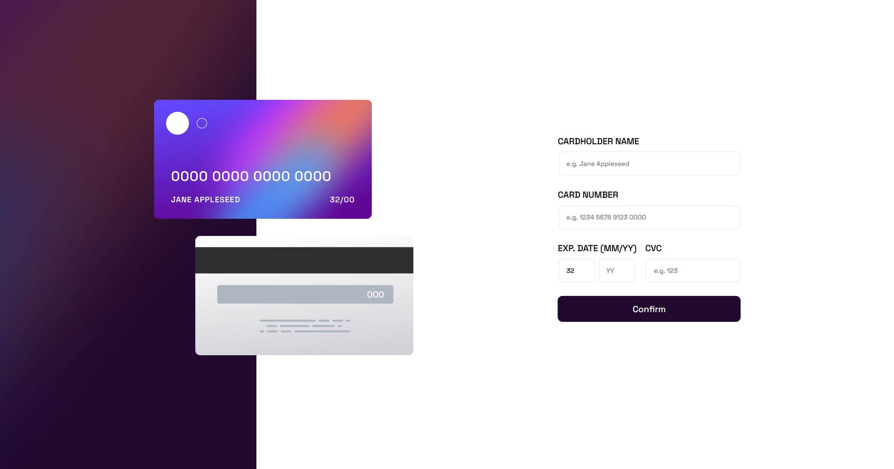

# Frontend Mentor - Interactive card details form solution

## Table of contents

- [Overview](#overview)
  - [The challenge](#the-challenge)
  - [Screenshot](#screenshot)
  - [Links](#links)
- [My process](#my-process)
  - [Built with](#built-with)
- [Author](#author)

## Overview

### The challenge

Users should be able to:

- Fill in the form and see the card details update in real-time
- Receive error messages when the form is submitted if:
  - Any input field is empty
  - The card number, expiry date, or CVC fields are in the wrong format
- View the optimal layout depending on their device's screen size
- See hover, active, and focus states for interactive elements on the page

### Screenshot

### Links

- Solution URL: [https://jakubbednarz25.github.io/product-preview-card-frontend-mentor/](https://jakubbednarz25.github.io/product-preview-card-frontend-mentor/)
- Live Site URL: [https://jakubbednarz25.github.io/product-preview-card-frontend-mentor/](https://jakubbednarz25.github.io/product-preview-card-frontend-mentor/)

## My process

### Built with

- Semantic HTML5 markup
- Flexbox
- Plain HTML + CSS

## Author

- GitHub - [Jakub bednarz](https://github.com/JakubBednarz25)
- Frontend Mentor - [@JakubBednarz25](https://www.frontendmentor.io/profile/JakubBednarz25)